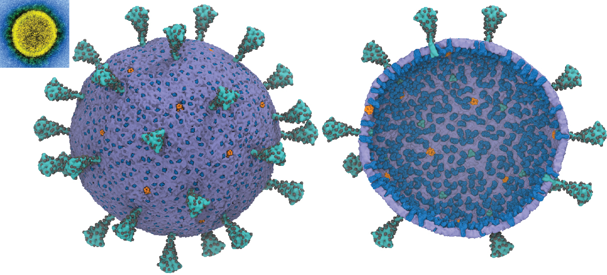

***Multiscale Models for the SARS-CoV-2 Virion***

This repository contains coarse-grained (CG) models for the SARS-CoV-2 virion developed 
under an NSF RAPID award 2029092 to G.A.V. in response to the COVID-19 pandemic.

If using these models, please cite:  
  [https://doi.org/10.34974/q8ya-wh69](https://doi.datacite.org/dois/10.34974%2Fq8ya-wh69)  
  https://doi.org/10.34974/j0v0-3d76 

Please note that these are currently under heavy development.

|            Files             |                   Description                 | References |
|------------------------------|-----------------------------------------------|------------|
| S-trimer-cg.pdb              | Coarse-grained model of the S protein trimer  |            |
| M-dimer-cg.pdb               | Coarse-grained model of the M protein dimer   |            |
| E-pentamer-cg.pdb            | Coarse-grained model of the E protein pentamer|            |
| lipid-cg.pdb                 | Coarse-grained lipid model                    | arXiv:1910.05362 |
| S-timer-aa.pdb               | All-atom model of the S protein trimer        | https://doi.org/10.1021/acscentsci.0c01056 |
| M-dimer-aa.pdb               | All-atom model of the M protein dimer         | https://doi.org/10.1101/2020.03.25.008904 |
| E-pentamer-aa.pdb            | All-atom model of the E protein pentamer      | https://dx.doi.org/10.3390%2Fv12040360 |
| lipid-aa.pdb                 | All-atom model of a POPC lipid patch          |            |
| sars-cov-2-virion-cg.pdb     | Coarse-grained model of the SARS-CoV-2 virion |            |
| cg-virion.data               | LAMMPS data file for the CG virion            |            |
| cg-virion.ff                 | Force-field parameters for the CG virion      |            |
| cg-virion.psf                | CG PSF file for the virion                    |            |
| cg-virion.dcd                | Subsampled DCD trajectory for the virion      |            |
| cg-virion-full.dcd           | Full DCD trajectory for the virion            |            |

  Voth Group
  Department of Chemistry  
  University of Chicago  

Contact:  
  yua@uchicago.edu  
  gavoth@uchicago.edu
